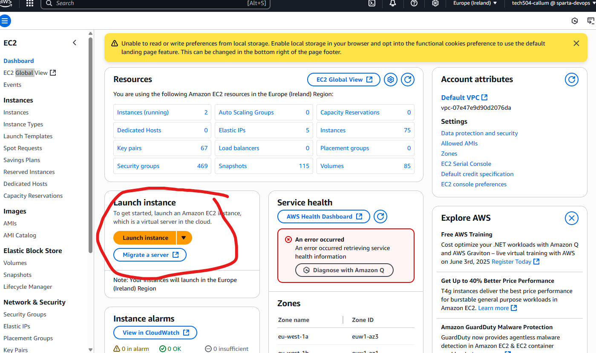

# General DevOps Notes
### TOCs
- [General DevOps Notes](#general-devops-notes)
    - [TOCs](#tocs)
- [Actual notes](#actual-notes)
    - [Random tools](#random-tools)
    - [Monolith vs 2-Tier Architecture](#monolith-vs-2-tier-architecture)
    - [Reverse Proxy](#reverse-proxy)
    - [Images](#images)
    - [Autoscaling](#autoscaling)
    - [Connecting to Instance groups](#connecting-to-instance-groups)
- [Google Cloud Platform](#google-cloud-platform)
    - [GCP Alert Management and Such](#gcp-alert-management-and-such)
    - [GCP Autoscaling](#gcp-autoscaling)
    - [GCP Database Security and Creating VPCs](#gcp-database-security-and-creating-vpcs)
- [AWS](#aws)
    - [Making a VM](#making-a-vm)

# Actual notes
### Random tools
- ps aux shows all processes
- printenv | sort shows all environment variables
- apache2-utils used for stress testing and such
  - ab -n 1000 -c 100 http://yourwebsite.com/
  - n is how many messages to send, c is how many to send at once

### Monolith vs 2-Tier Architecture
A monolith is a big ol system running everything on one machine. There may be multiple layers (e.g. ui, logic, database) in the monolith. It's hard to scale, and if you have a database you might have to rewrite a lot of code to have that work across multiple instances.

### Reverse Proxy
 - Can be a server which sits in front of backend servers, redirecting traffic and shielding internal servers from attack
 - Allows a single domain to have multiple back-end servers by having the reverse-proxy redirecting traffic where it's needed
   - Single external IP allows for a "friendly" url -> no port numbers
 - The reverse proxy can do load-balancing
 - It can handle caching as well
 - Can handle SSL encryption and user authentication

### Images
A regular image just contains the data from the disk of a system. A machine image includes extra info about the machine/vm including metadata

### Autoscaling
If your load/memory/cpu/whatever is too high response times increase, bugs may appear, and it may crash entirely.

There are two types of autoscaling:
- **Horizontal**: Add more machines (called scaling out/in)
- **Vertical**: Make machine bigger/move to a bigger machine (called scaling up/down)

### Connecting to Instance groups
Bastion host - a very secure "hardened" machine that can be used as a "jumpbox" to remote into any machine on the internal network

# Google Cloud Platform
### GCP Alert Management and Such
GCP let's you set up alerts for a bunch of different metrics and with pretty details configuration. 

### GCP Autoscaling
1. create vm image and startup script
2. make instance template using image
3. Use to make instance group
   1. set stuff like util threshold for scaling
4. Make health checker
5. Gotta set up a load-balancer
   1.  load balancer gets its own subnet
   2.  front end forwarding rule must be configured
   3.  back end to be configured. Select health check, utilization settings/balancing mode
   
### GCP Database Security and Creating VPCs
We start in a custom VPC (virtual private cloud). The VPC has it's own CIDR block (e.g. 10.0.0.0/16). We make two subnets - one public, one private - with different CIDR blocks (e.g. 10.0.2.0/24 and 10.0.3.0/24).

To set up the database in the private subnet, use an image of the db VM. During the VM creation we select VPC in the network settings. We need to set up network tags, so we can later set firewall rules to allow the traffic we want (firewall rules are set at the VPC level). We also need to set up a way to access the machine remotely - security (on VM creation) select "Control VM access through IAM permissions".

Firewall rules are set up like this: Target tag (e.g. db-server) and Source tag (e.g. http-server) (This can be done via tags or IP ranges). You also need to specify the protocol (TCP) and the port (27017 is std for mongodb)

Next we make an App VM in the public subnet.

Some resources:
 - https://medium.com/google-cloud/best-practices-for-creating-secure-private-gcp-vm-instance-6f0872f34bb
 - https://cloud.google.com/blog/products/gcp/best-practices-for-securing-your-google-cloud-databases
 - https://cloud.google.com/blog/products/identity-security/preventing-lateral-movement-in-google-compute-engine
 - https://cloud.google.com/iap/docs/using-tcp-forwarding#create-firewall-rule
 

# AWS
It's similar to GCP, but the interface is somehow worse.

### Making a VM
Smash this button on the EC2 Dashboard

- This leads to a similar screen to GCP. Name instance, choose OS image, set instance type. 
- In AWS you have to specify the access key pair for each vm. It's annoying
- you then set up network permissions. For some reason, this has to be part of a 'security group', so you either need to use an existing group or make a new one.
- then hidden at the bottom is the entry for userdata (startup script). Unlike in GCP, this is only run when the VM is built, not when it gets restarted.

