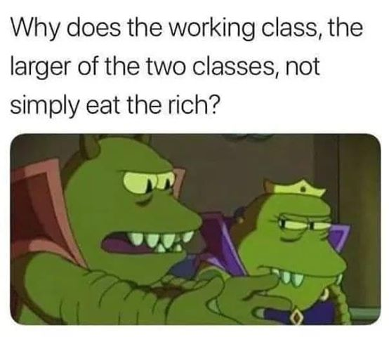

# Learning Markdown 101

## Part 1: Decoration

*italics*

_also italics_

**bold**

__also bold__

## Part 2: Structure

### Quoting

> This is not a quote
>> But this is

### Lists

- an uo
- and such
  - a sub-list
    - sub sub list
- yay

1. a numbered list
2. works
   1. basically the same
4. way.
1. numbers are flexible

## Part 3: Embedding



Where do you want to go? <br>
[back to part 2](#part-2-structure) <br>
[To a website](https://www.google.com)

## Part 4: Let's Coooooode

code looks like <br>
`backticks == sad`

you can also <br>
```python
make = 2
big = 3
blocks = False
```

## Part 5: Everything else is Boring

* [ ] not done
* [x] done

| Col 1 | Col 2 |  Col 3 |
|-------|-------|---------|
| some  | stuff | here |
|  and  | yet | more |